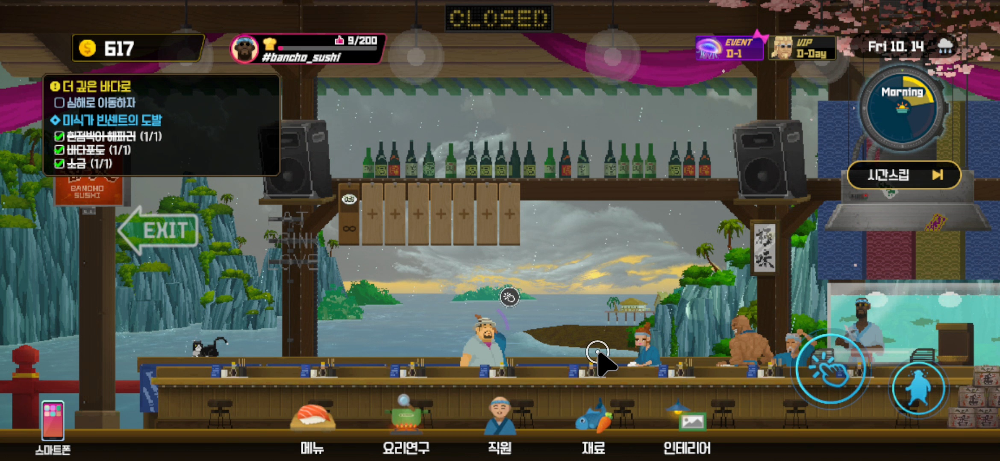

# mouseCursor

마우스 커서를 숨기는 안드로이드 게임에서 커서를 대신 그리고, 마우스 클릭을 터치로 변환하는 접근성 서비스.

키보드와 마우스로 모바일 게임(데이브 더 다이버)을 하는데 게임 안에서 마우스 커서가 사라져서 만들었다.



흰 링이 이 앱이 그린 커서다. 검은 화살표는 시스템 커서로, 화면 녹화본에만 찍힌다.

## 동작 방식

1. **대상 앱 감지**: 창 변경 이벤트(`TYPE_WINDOW_STATE_CHANGED`, `TYPE_WINDOWS_CHANGED`)와 1초 주기 확인으로 활성 창의 패키지명을 읽는다. systemui와 삼성 키보드는 무시한다.
2. **마우스 입력 가져오기**: 대상 앱이 앞에 있으면 `setMotionEventSources(SOURCE_MOUSE)`로 마우스 이벤트를 서비스가 받는다. 다른 앱에서는 `0`으로 되돌려 시스템 기본 동작을 쓴다.
3. **커서 표시**: 마우스 좌표에 링 모양 오버레이(`TYPE_ACCESSIBILITY_OVERLAY`)를 그린다. 링 중심이 터치 지점이다. 누르는 동안 안쪽이 채워지고 0.8배로 줄어든다. 3초간 입력이 없으면 사라진다.
4. **터치 재현**: 버튼을 뗄 때 누른 위치부터 뗀 위치까지, 누른 시간만큼 `dispatchGesture`로 터치를 보낸다. 이동 거리가 15px 이하면 탭, 넘으면 직선 드래그다.

## 빌드 환경

| 구분 | 값 |
|---|---|
| IDE | Android Code Studio (AndroidIDE 포크) v1.0.0+gh.r4 |
| 빌드 도구 | Gradle 9.0.0, AGP 8.13.0, JDK 17 |
| SDK | compileSdk 36, minSdk 35, targetSdk 36 |
| 언어 | Java |
| 확인한 기기 | 갤럭시 S26 울트라, Android 16 |

`kotlin-stdlib` 의존성은 Android Code Studio가 디버그 빌드에 넣는 로그 수집기(LogWire)용이다. 앱 코드는 쓰지 않는다.

## 설치와 사용

1. 프로젝트를 빌드해 설치한다. 실행할 화면(Activity)이 없으므로 설치 후 "Launch failed"가 표시된다.
2. 설정 > 접근성 > 설치된 앱 > **마우스 커서**를 켠다.
   - 스위치가 비활성이면: 설정 > 애플리케이션 > mouseCursor > ⋮ > **제한된 설정 허용**.
3. 대상 게임을 실행하면 커서가 표시된다.

`res/xml/cursor_service.xml`을 수정한 뒤에는 접근성에서 서비스를 껐다 켜야 반영된다.

서비스를 강제로 끄려면 볼륨 위·아래 버튼을 함께 길게 누른다(접근성 설정에서 바로가기를 켠 경우).

### 대상 앱 추가

`CursorService.java`의 `TARGET_PACKAGES`에 패키지명을 추가하고 다시 빌드한다.

```java
private static final Set<String> TARGET_PACKAGES = new HashSet<>(Arrays.asList(
        "com.mintrocket.drmobile"   // 데이브 더 다이버 모바일
));
```

`DEBUG = true`로 빌드하면 화면에 디버그창이 표시된다. 현재 앱의 패키지명, 커서 모드, 감지 경로, 마지막 동작을 보여준다.

### 설정값

| 상수 | 기본값 | 의미 |
|---|---|---|
| `CURSOR_SIZE_DP` | 24 | 커서 크기 |
| `CURSOR_ALPHA` | 0.75 | 평소 투명도 |
| `PRESSED_SCALE` | 0.8 | 누를 때 크기 비율 |
| `HIDE_DELAY` | 3000 | 자동 숨김까지 시간(ms) |
| `POLL_INTERVAL` | 1000 | 주기 확인 간격(ms) |

## 권한

| 설정 | 용도 |
|---|---|
| `canPerformGestures` | 클릭을 터치로 재현 |
| `canRetrieveWindowContent` | 활성 창의 패키지명 확인 |
| `flagRetrieveInteractiveWindows` | 창 변경 이벤트 수신 |

코드는 활성 창의 패키지명만 읽는다. 인터넷 권한은 요청하지 않는다.

## 알려진 한계

- **입력 지연**: 터치가 버튼을 뗄 때 실행된다. 길게 누르기와 드래그가 실시간이 아니다.
- **드래그 경로**: 시작점과 끝점을 잇는 직선으로만 재현한다.
- **제스처 끊김**: 새 제스처가 들어오면 진행 중인 제스처가 취소된다.
- **휠, 우클릭**: 대상 게임 안에서는 처리하지 않는다.
- **하드코딩**: 대상 앱과 무시할 앱 목록이 코드에 있다.
- `setObservedMotionEventSources()`(가로채지 않고 관찰만 하는 방식)는 확인한 기기에 메서드가 없어 쓰지 못했다.

## 할 일

- [ ] `StrokeDescription`의 `willContinue` / `continueStroke()`로 실시간 터치 전달
- [ ] 게임 안에서 휠을 스와이프로 변환
